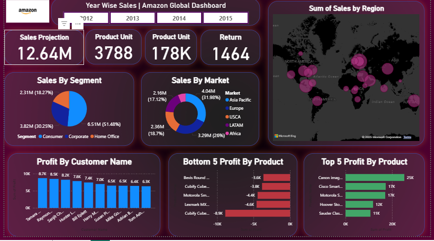

# 📊 Amazon Global Sales Dashboard (Power BI)

## 🔍 Project Overview
This project analyzes global sales, profit, and returns using the Amazon Superstore dataset.  
The goal was to build an interactive Power BI dashboard to uncover insights into customer segments, regional markets, product performance, and return trends.

## 🗂 Dataset
- **Source:** Global Superstore dataset (Excel)
- **Period Covered:** 2012–2015
- **Rows:** 178K records
- **Fields Included:** Order Date, Market, Segment, Region, Product, Sales, Profit, Quantity, Discount, Returns

## 📈 Key Metrics
- **Total Sales:** $12.64M  
- **Total Quantity Sold:** 178K units  
- **Total Returns:** 1,464 items  
- **Unique Products Sold:** 3,788  

## 🔑 Insights
- 🛒 **Consumer segment** contributes 51% of total sales.  
- 🌍 **Europe** is the highest revenue market (32% share).  
- 💰 **Top products** (Canon, Cisco, Motorola) generate most profit.  
- 📉 Some products show **negative profit** (e.g., Cubify Cube, Lenovo), needing pricing/discount review.  
- 📦 **Return volume (1,464 items)** highlights potential supply chain or product quality issues.

## 📷 Dashboard Preview

## 📂 Files in this Repository
- `Amazon superstore report.pbix` → Power BI file  
- `dashboard_preview.png` → Dashboard preview image   

## 🛠 Tools Used
- **Power BI** → Data modeling & visualization  
- **Excel** → Data source (cleaning & preparation)  

---

✨ This project demonstrates skills in **data visualization, business reporting, and KPI analysis** — critical for a Data Analyst role.
